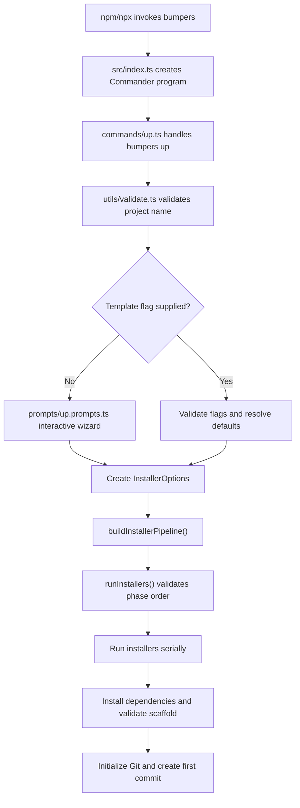
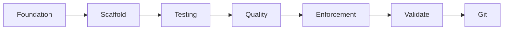
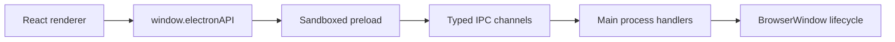
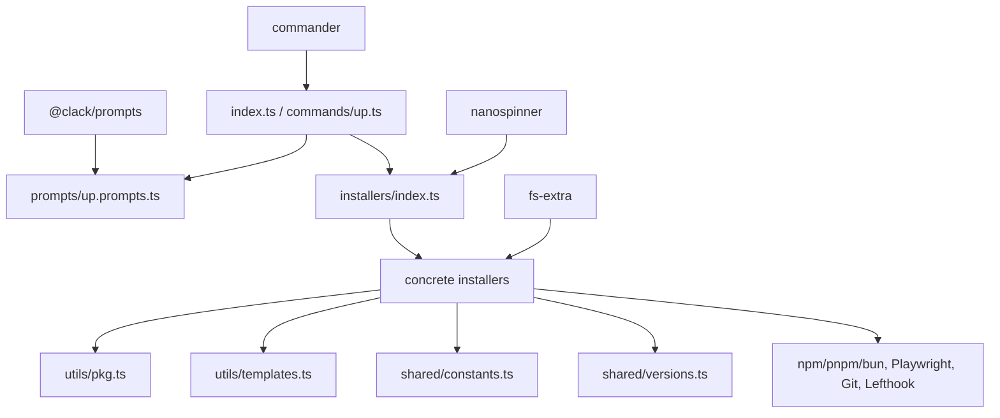

# Bumpers Codebase Map

Bumpers is an npm-workspace CLI that scaffolds Electron, Microsoft Teams Tab, and React applications with testing and quality guardrails already configured.

## Repository map

```text
.
├── package.json                         # Private npm workspace root
├── package-lock.json
├── README.md
├── AGENTS.md                            # Contributor and template conventions
├── CLAUDE.md                            # Synchronized agent instructions
├── scripts/
│   └── sync-agent-instructions.mjs      # Keeps agent instruction files aligned
└── packages/
    └── bumpers-cli/                     # Published `bumpers` package
        ├── package.json                 # Binary, scripts, and dependencies
        ├── tsup.config.ts               # ESM CLI build
        ├── tsconfig.json
        ├── vitest.config.ts
        ├── src/
        │   ├── index.ts                 # CLI entry point
        │   ├── commands/up.ts           # `bumpers up` command and pipeline
        │   ├── prompts/up.prompts.ts    # Interactive setup wizard
        │   ├── installers/              # Scaffold feature implementations
        │   ├── shared/                  # Shared paths, versions, and help text
        │   └── utils/                   # Git, package, template, validation helpers
        ├── templates/                   # Files copied into generated projects
        └── tests/                       # Unit, contract, and scaffold tests
```

The root only coordinates the workspace and instruction synchronization. Product code lives in `packages/bumpers-cli`.

## Runtime flow



### Entry and build

- `packages/bumpers-cli/src/index.ts` creates the Commander program, registers the command, and detects direct execution through real paths so npm binary symlinks work.
- `packages/bumpers-cli/package.json` maps the `bumpers` binary to `dist/index.js`.
- `packages/bumpers-cli/tsup.config.ts` bundles the TypeScript entry point as an ESM Node CLI.
- The package build copies `templates/` to `dist/templates/`; runtime template resolution depends on those files being present.

## CLI features

The CLI exposes one product command: `bumpers up <project-name>`. Commander provides top-level help and version output.

| Feature | User interface | Implementation |
|---|---|---|
| Electron scaffold | `--electron` | `src/commands/up.ts`, `src/installers/electron.installer.ts` |
| Teams Tab scaffold | `--teams-tab` | `src/commands/up.ts`, `src/installers/teams-tab.installer.ts`, `templates/teams-tab/` |
| React SPA scaffold | `--react` | `src/commands/up.ts`, `src/installers/react.installer.ts`, `templates/react/` |
| Teams display name | `--display-name <name>` with `--teams-tab` | `src/commands/up.ts`, `src/installers/teams-tab.installer.ts` |
| Package manager selection | `--pm <manager>`; interactive npm, pnpm, or Bun selection | `src/commands/up.ts`, `src/prompts/up.prompts.ts`, runtime installers |
| React router selection | `--router tanstack\|react-router\|wouter\|none` | `src/commands/up.ts`, `src/installers/react.installer.ts`, router template variants |
| React state selection | `--state zustand\|jotai\|redux-toolkit\|none` | `src/commands/up.ts`, `src/installers/react.installer.ts`, state template variants |
| Interactive setup | Run without a template flag | `src/prompts/up.prompts.ts` |
| Project-name validation | Applied before creating the target directory | `src/utils/validate.ts` |
| Detailed CLI help | `--help` | `src/shared/help.ts`, `src/index.ts`, `src/commands/up.ts` |

Template flags are mutually exclusive. React router and state flags require `--react`; the display name requires `--teams-tab`.

### React defaults

Defined by `DEFAULT_REACT_OPTIONS` in `src/commands/up.ts`:

- TanStack Router
- Zustand
- Axios
- TanStack Query
- Tailwind CSS

Selecting Redux Toolkit switches the generated data stack to Fetch and RTK Query.

## Installer architecture

The shared installer contract is in `packages/bumpers-cli/src/installers/index.ts`:

```text
Installer
├── name   User-facing spinner text
├── phase  Ordering boundary
└── run    Async scaffold mutation
```

`runInstallers()` rejects pipelines whose phases move backward, then executes each installer serially against the same target directory.



| Order | Phase | Responsibility | Implementation |
|---:|---|---|---|
| 1 | Foundation | Base package, TypeScript, ignore files, environment example, README | `base.installer.ts` |
| 2 | Scaffold | Selected Electron, Teams Tab, or React application | `electron.installer.ts`, `teams-tab.installer.ts`, `react.installer.ts` |
| 3 | Testing | Vitest | `vitest.installer.ts`, `templates/vitest/` |
| 4 | Testing | Playwright | `playwright.installer.ts`, `templates/playwright/` |
| 5 | Testing | Storybook | `storybook.installer.ts`, `templates/storybook/` |
| 6 | Quality | ESLint | `eslint.installer.ts` |
| 7 | Quality | Biome formatting | `biome.installer.ts` |
| 8 | Enforcement | Source structure checks | `colocate.installer.ts`, `templates/colocate/` |
| 9 | Enforcement | Lefthook and Commitlint | `hooks.installer.ts`, `templates/hooks/` |
| 10 | Enforcement | GitHub Actions | `github-actions.installer.ts`, `templates/github-actions/` |
| 11 | Enforcement | AI/editor guidance | `ai-config.installer.ts`, `react-ai-config.ts`, `templates/ai-config/` |
| 12 | Validate | Dependency installation and generated-project checks | `validate.installer.ts` |
| 13 | Git | Repository initialization, first commit, hook installation | `git.installer.ts`, `utils/git.ts` |

The pipeline is assembled in `src/commands/up.ts`. Validation must remain second-to-last and Git last.

## Scaffold implementations

### Electron

Primary implementation: `src/installers/electron.installer.ts`.



Generated boundaries:

- `src/main/` owns Electron main-process behavior.
- `src/preload/` exposes the restricted renderer API.
- `src/renderer/src/` owns the React UI.
- Shared IPC channel names and types define the process contract.
- The generated window uses context isolation and sandboxing with Node integration disabled.

Electron Playwright assets are under `templates/playwright/electron/`. Other Electron source and configuration are currently emitted by the relevant installers.

### Microsoft Teams Tab

Primary implementation: `src/installers/teams-tab.installer.ts`.

Template assets under `templates/teams-tab/` provide:

- the React/Vite application under `src/`;
- Teams SDK context UI;
- Teams manifest and icons;
- local development and app-packaging scripts.

The installer generates the Teams application ID. The project name remains the package/filesystem name, while `displayName` controls user-facing Teams labels.

### React SPA

Primary implementation: `src/installers/react.installer.ts`.

Common source lives in `templates/react/`. Variant folders supply complete files for selected combinations:

| Choice | Template/implementation areas |
|---|---|
| TanStack Router | `templates/react/router-tanstack/`, `src/routes/`, `tsr.config.json` |
| React Router | `templates/react/router-react-router/`, `src/pages/` |
| Wouter | `templates/react/router-wouter/`, `src/pages/` |
| No router | `templates/react/router-none/` |
| Zustand | common `src/store/counter.ts` template |
| Jotai | `templates/react/state-jotai/` |
| Redux Toolkit/RTK Query | `templates/react/state-redux-toolkit/` |
| No state library | `templates/react/state-none/` |

TanStack route generation is incorporated into generated build and test commands. Its generated `src/routeTree.gen.ts` is excluded from Git, linting, formatting, coverage, and source structure enforcement.

## Cross-cutting generated features

| Generated feature | Ownership |
|---|---|
| Package metadata and scripts | `src/utils/pkg.ts` plus individual installers |
| Dependency versions | `src/shared/versions.ts` |
| Shared output paths, globs, test IDs, ports, and IPC names | `src/shared/constants.ts` |
| Template lookup and placeholder substitution | `src/utils/templates.ts` |
| Unit/component tests and coverage | `src/installers/vitest.installer.ts`, `templates/vitest/` |
| E2E and screenshot tests | `src/installers/playwright.installer.ts`, `templates/playwright/` |
| Component stories | `src/installers/storybook.installer.ts`, `templates/storybook/` |
| Linting | `src/installers/eslint.installer.ts` |
| Formatting | `src/installers/biome.installer.ts` |
| Source structure rules | `src/installers/colocate.installer.ts`, `templates/colocate/` |
| Pre-commit and commit-message checks | `src/installers/hooks.installer.ts`, `templates/hooks/` |
| CI | `src/installers/github-actions.installer.ts`, `templates/github-actions/` |
| Generated contributor/AI instructions | `src/installers/ai-config.installer.ts`, `src/installers/react-ai-config.ts`, `templates/ai-config/` |
| Post-generation command checks | `src/installers/validate.installer.ts` |
| Initial Git repository and commit | `src/installers/git.installer.ts`, `src/utils/git.ts` |

## Template asset map

```text
packages/bumpers-cli/templates/
├── ai-config/       # General and stack-aware generated instructions
├── colocate/        # Source structure checker
├── github-actions/  # Template-specific CI workflows
├── hooks/           # Lefthook configuration
├── playwright/      # E2E configs and specs by scaffold variant
├── react/           # React source and router/state variants
├── storybook/       # Storybook configs and stories
├── teams-tab/       # Teams source, manifest, icons, and scripts
├── vitest/          # Unit/component configs and tests
├── tsconfig.json    # Type-check project for template source
└── typecheck-shims.d.ts
```

Large generated files belong here rather than in inline `writeFile` strings. This convention is documented in `AGENTS.md`.

## Dependency boundaries



The CLI's runtime dependencies are orchestration libraries only. Electron, React, Vite, testing, and generated application dependencies are written into scaffolded projects using versions from `src/shared/versions.ts`.

## Test map

| Test area | Files | Purpose |
|---|---|---|
| CLI entry | `tests/index.test.ts` | Binary and symlink entry detection |
| Help contracts | `tests/help.test.ts` | Top-level and command help |
| Command behavior | `tests/up-command.test.ts` | Flags, defaults, invalid combinations, prompt bypass |
| Prompt behavior | `tests/prompts.test.ts` | Interactive choices and React flow |
| Input validation | `tests/validate.test.ts` | Project-name rules |
| Installer contracts | `tests/installers.test.ts` | Pipeline composition, phases, and shared constants |
| Template utilities | `tests/templates.test.ts` | Substitution and nested output |
| React AI guidance | `tests/react-ai-config.test.ts`, `tests/__snapshots__/` | Stack-aware generated instructions |
| Electron scaffold | `tests/integration/scaffold.test.ts` | Generated files and cross-installer contracts |
| Teams scaffold | `tests/integration/scaffold-teams-tab.test.ts` | Teams output, tests, CI, and instructions |
| React scaffold | `tests/integration/scaffold-react.test.ts` | Router/state combinations and guardrails |
| Full generated project | `tests/integration/full-pipeline.test.ts` | Real installation, checks, build, E2E, and Git |

The full pipeline test is opt-in through `FULL_INTEGRATION=1` / the package's `test:full` script.

## Maintenance invariants

- Preserve the numeric order of `InstallerPhase`; it is a runtime contract.
- Keep `installValidate` immediately before `installGit`, and keep Git last.
- Preserve Electron's main/preload/renderer security boundary.
- Keep generated script names synchronized across validation, hooks, CI, and instructions.
- Keep shared paths, test IDs, globs, ports, and IPC names in `src/shared/constants.ts`.
- Keep generated dependency versions in `src/shared/versions.ts`.
- Keep template copying in the package build and template resolution compatible with source and `dist` layouts.
- Treat TanStack's route tree as generated output everywhere.
- Prefer installer-owned template files for substantial generated content.

## Common development commands

```bash
npm test --workspace packages/bumpers-cli
npm run build --workspace packages/bumpers-cli
npm run test:templates --workspace packages/bumpers-cli
npm run test:full --workspace packages/bumpers-cli
```
